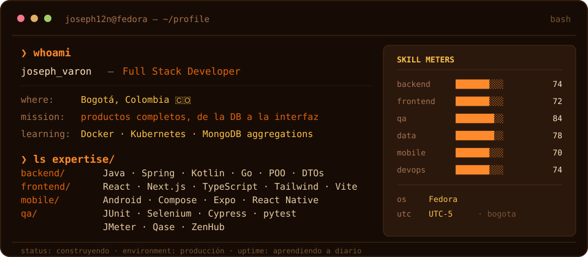

<a href="https://github.com/joseph12n">
  <picture>
    <source media="(prefers-color-scheme: dark)" srcset="assets/banner-dark.svg">
    <source media="(prefers-color-scheme: light)" srcset="assets/banner-light.svg">
    
  </picture>
</a>

 

  
  

---

## `$ whoami`

  

---

## `$ cat tech-stack.yaml`

<table border="1" cellpadding="14" bgcolor="#160C05">
  <thead>
    <tr>
      <th colspan="2" align="left"><code>joseph12n:~$ cat tech-stack.yaml</code></th>
    </tr>
  </thead>
  <tbody>
    <tr>
      <td width="50%" valign="top"><code>├─ ⚙ backend_java:</code>  
         
        <code>Java · Kotlin · Spring Boot · Maven · Gradle</code>
      </td>
      <td width="50%" valign="top"><code>├─ ⚛ frontend_web:</code>  
         
        <code>React · Next.js · TypeScript · Tailwind · Node.js</code>
      </td>
    </tr>
    <tr>
      <td valign="top"><code>├─ ▣ data_storage:</code>  
         
        <code>MongoDB · PostgreSQL · MySQL · Redis · SQLite</code>
      </td>
      <td valign="top"><code>├─ ◉ qa_quality:</code>  
         
        <code>JUnit · Vitest · Cypress · pytest · JMeter · Qase</code>
      </td>
    </tr>
    <tr>
      <td valign="top"><code>├─ ☁ mobile_apps:</code>  
         
        <code>Android · Jetpack Compose · Expo · React Native</code>
      </td>
      <td valign="top"><code>╰─ ✦ ai_agentic:</code>  
         
        <code>Model Context Protocol · Ollama · OpenCode · Docker</code>
      </td>
    </tr>
  </tbody>
  <tfoot>
    <tr>
      <td colspan="2"><code>status: construyendo&nbsp;&nbsp;·&nbsp;&nbsp;environment: fedora&nbsp;&nbsp;·&nbsp;&nbsp;editor: vscode</code></td>
    </tr>
  </tfoot>
</table>

---

## `$ kubectl get skills --all-namespaces`

  <picture>
    <source media="(prefers-color-scheme: dark)" srcset="assets/radar-dark.svg">
    <source media="(prefers-color-scheme: light)" srcset="assets/radar-light.svg">
    
  </picture>&nbsp;&nbsp;
  <picture>
    <source media="(prefers-color-scheme: dark)" srcset="assets/radar-langs-dark.svg">
    <source media="(prefers-color-scheme: light)" srcset="assets/radar-langs-light.svg">
    
  </picture>

<code>skills: dev_stack · languages: live_github_api · status: healthy</code>

---

## `$ ls projects/`

🛒 **[KN-Store](https://github.com/joseph12n/knstore)** — E-commerce para una zapatería: catálogo, roles, inventario en tiempo real y envíos. Backend en Spring Boot + MongoDB, frontend en [KN-StoreJS](https://github.com/joseph12n/KN-StoreJS) (Next.js + React 19), reportes de QA en [pruebas](https://github.com/joseph12n/pruebas).

💰 **[Dumy](https://github.com/joseph12n/Dumy)** — App de finanzas personales offline (Expo + React Native + SQLite) con un asistente de 12 skills y OCR en el dispositivo. Todo queda en el teléfono. [Descargar el APK](https://github.com/joseph12n/Dumy/releases/latest).

🧾 **[Solanium](https://github.com/joseph12n/solanium)** — SaaS de facturación multi-tenant: cada cliente activa su cuenta con un token y la interfaz se adapta a su negocio. Next.js 14 + Tailwind.

🧮 **[Lab Supplies Calculator](https://github.com/joseph12n/calculadora-insumos)** — App Android para contar insumos de laboratorio, diseñada para adultos mayores: botones grandes, sin internet y lectura de números desde una foto con ML Kit. Kotlin + Compose + Room, con 75 pruebas unitarias.

🏘️ **[Residential Management](https://github.com/joseph12n/conjuntos_residenciales-main)** — Mi primer sistema armado a mano: reservas para conjuntos residenciales. PHP + MySQL.

<code>ls --all ./repos</code>

 

- [`qasepy`](https://github.com/joseph12n/qasepy) — Script en Python para subir requisitos y casos de prueba a qase.io.
- [`project-yml`](https://github.com/joseph12n/project-yml) — Ejercicio de MongoDB + Spring Boot.
- [`BackendSena`](https://github.com/joseph12n/BackendSena) — Ejercicios CRUD del SENA.
- [`Java_docs`](https://github.com/joseph12n/Java_docs) — Apuntes de Java.
- [`ambiente104`](https://github.com/joseph12n/ambiente104) — Experimentos varios.

---

## `$ git log --oneline`

  
  
  

## `$ git log --graph`

  <picture>
    <source media="(prefers-color-scheme: dark)" srcset="https://raw.githubusercontent.com/joseph12n/joseph12n/output/github-contribution-grid-snake-dark.svg" />
    <source media="(prefers-color-scheme: light)" srcset="https://raw.githubusercontent.com/joseph12n/joseph12n/output/github-contribution-grid-snake.svg" />
    
  </picture>

---

## `$ connect --socials`

&nbsp;&nbsp;
&nbsp;&nbsp;

  

Si quieres hablar de un proyecto o tienes una duda, escríbeme sin problema.

---

  
    Construido desde <code>assets/</code> y <code>scripts/</code> · gopher © Renee French (CC BY 3.0)
  

